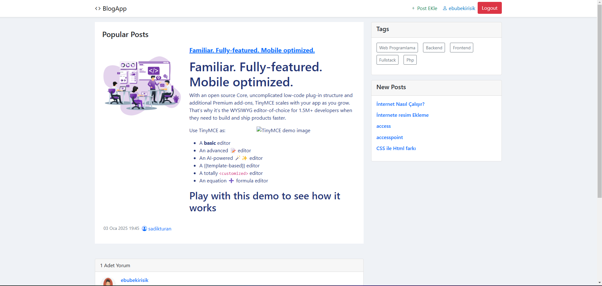

# BlogApp - Blog Yönetim Sistemi

Bu proje, kullanıcıların üye olup blog yazıları paylaşabildiği bir **Blog Yönetim Uygulaması**dır. ASP.NET MVC, Entity Framework ve Authentication kullanılarak geliştirilmiştir.

## Özellikler

### Kullanıcı Yönetimi
- Kullanıcı kaydı ve girişi
- Rol tabanlı yetkilendirme (Yönetici ve Kullanıcı rolleri)

### Blog Yönetimi
- Blog ekleme
- Tüm kullanıcıların bloglarını görüntüleme

### Ekstra Özellikler
- Responsive tasarım (Bootstrap ile)
- Kullanıcı dostu arayüz

---

## Kullanılan Teknolojiler
- **ASP.NET MVC**  
- **Entity Framework**  
- **Authentication**  
- **Bootstrap**  
- **SQLite**  

---
## Ekran Görüntüleri
- **Ana Sayfa**  

- **Post Detayı**

- **Post Detayı**

- **Yeni Post Oluşturma**

- **Login Sayfası**

- **Kayıt Olma Sayfası**

- **Hesabı Olmayan Kişinin Ana Sayfası**

